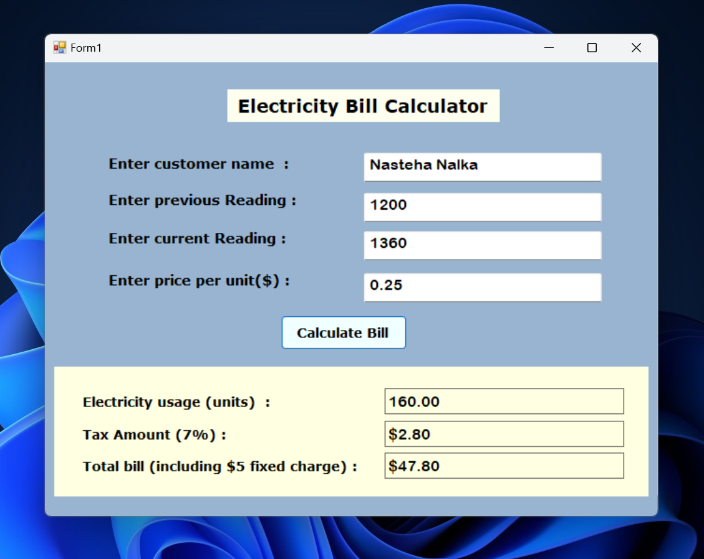

### Assignment Three Screenshoot

## Calculate Bill Button
A Calculate Bill button is used to calculate the total amount of a bill and displays the output results in the output label

 you can also press (Alt+C) to calculate and display the results
