# C# Week 2 – Processing Data

## Overview

Week 2 focuses on **Processing Data in C# Windows Forms**.

This chapter explains how a Windows Forms application receives data from the user, stores it, processes it, performs calculations, converts data types, handles errors, and displays results.

## Importance

Data processing is an important part of programming because applications need to:

* Receive user input
* Store information
* Perform calculations
* Convert data
* Handle errors
* Display useful results

## Objectives

After completing this chapter, I should understand:

* Variables and data types
* TextBox input and strings
* Numeric data and calculations
* Type conversion and parsing
* `ToString()` and number formatting
* Exception handling with `try-catch`
* Constants and fields
* Using the `Math` class
* Focus and tab order
* Windows Forms colors and backgrounds
* Panel and GroupBox
* Logic errors and debugging

## Main Concept

The main data flow of this chapter is:

```text
User Input
    ↓
Store Data
    ↓
Convert Data
    ↓
Process / Calculate
    ↓
Handle Errors
    ↓
Display Result
```

## Practical Importance

These concepts are used in real applications such as:

* Student Management Systems
* Library Systems
* Billing Applications
* Salary Calculators
* Registration Forms
* Inventory Systems

## Screenshots & Code

The screenshots in this folder demonstrate the practical examples from the chapter.

Instead of explaining every line of code separately, the screenshots show how the concepts are implemented in a real Windows Forms application.

The main idea is to understand **what the code does, why it is used, and what result it produces**.


# Screenshots

Screenshots of the practical work are stored in the `screenshoots` folder.

### Declaring variables

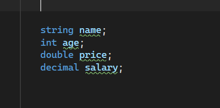


### Assigning values

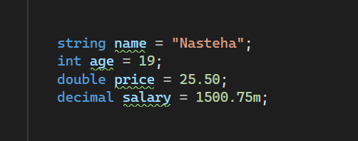

### Displaying output using messageBox

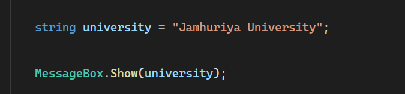

### Displaying output using label

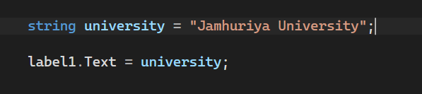


### convert to string

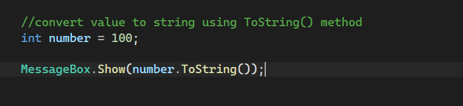

### Combine text with number

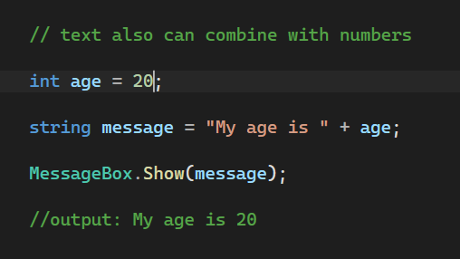

### Convert to string


### Var Keyword

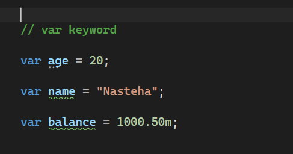


### Named Constant

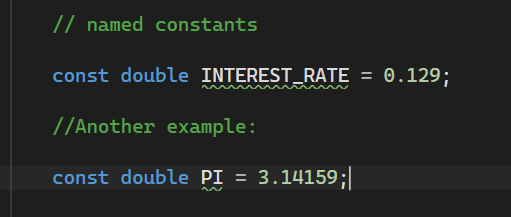

### String Concatenation

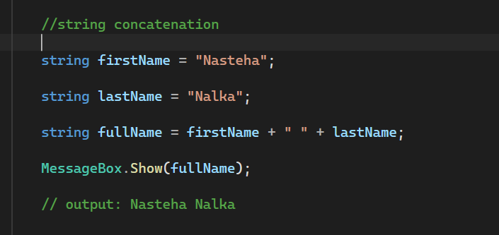

### Type casting

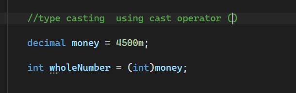

### Exception Handling

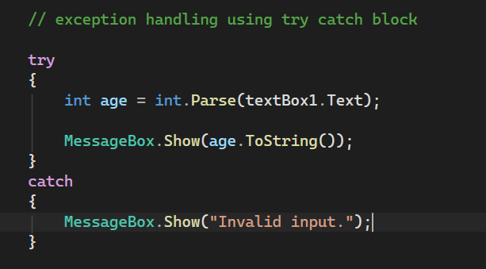

## Final Summary

Week 2 teaches the basic process of working with data in C#:

**Input → Store → Convert → Process → Handle Errors → Display Output**

This chapter provides the foundation for building useful and interactive C# Windows Forms applications.
